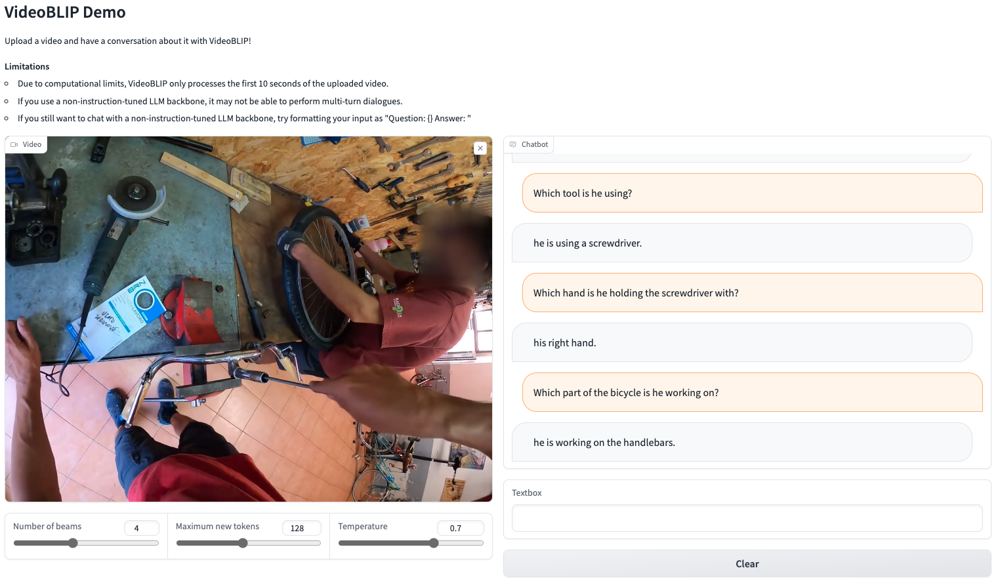

# VideoBLIP: Supercharged [BLIP-2](https://arxiv.org/abs/2301.12597) that can handle videos.

<!---
[](https://48f6-141-212-106-177.ngrok-free.app/)
-->
*Live demo has been suspended until further notice.*



## Features

- Generate texts based on videos.
- Have a chat about a video.
- Optimized for egocentric views.

## Upcoming Features

- Bigger models.
- In-context learning.

## Setup

```bash
# Install poetry https://python-poetry.org/
curl -sSL https://install.python-poetry.org | python3 -

# Clone the repository
git clone git@github.com:yukw777/VideoBLIP.git
cd VideoBLIP

# Install VideoBLIP using poetry
# Note: if you notice "keyring" related error messages or poetry hanging,
# pelase export the following environment variable.
# More info can be found here: https://github.com/python-poetry/poetry/issues/1917
export PYTHON_KEYRING_BACKEND=keyring.backends.null.Keyring
poetry install

# Activate the poetry virtualenv
poetry shell
```

## Running Demo Locally

```bash
# Run `python demo/app.py --help` for details
# By default, the demo uses `kpyu/video-blip-flan-t5-xl-ego4d`, which requires about 16GB of VRAM.
python demo/app.py --device cuda
```

## Pretrained Weights

- [`kpyu/video-blip-opt-2.7b-ego4d`](https://huggingface.co/kpyu/video-blip-opt-2.7b-ego4d)
  - VideoBLIP initialized with [`Salesforce/blip2-opt-2.7b`](https://huggingface.co/Salesforce/blip2-opt-2.7b) and fine-tuned on Ego4D.
- [`kpyu/video-blip-flan-t5-xl`](https://huggingface.co/kpyu/video-blip-opt-2.7b-ego4d)
  - VideoBLIP initialized with [`Salesforce/blip2-flan-t5-xl`](https://huggingface.co/Salesforce/blip2-flan-t5-xl) and fine-tuned on Ego4D.

## Training

**1. Download Ego4D**
You need the `fho` benchmark data from Ego4D. Below is an example command to download it. Please refer to the official [Ego4D website](https://ego4d-data.org/) for more details.

```bash
ego4d --output_directory="<output_dir>" --datasets full_scale annotations --benchmarks fho
```

**2. Extract frames**
Once you have the `fho` benchmark data from Ego4D, run the following commands to split train and validation data and extract frames.

```bash
# First split train and validation data
python scripts/split_train_val.py \
    path/to/ego4d/v2/annotations/fho_main.json \
    path/to/extracted/frames \
    path/to/ego4d/v2/full_scale

# Extract frames
SPLIT=(train|val)
MODEL=<your-base-blip2-model> # e.g., Salesforce/blip2-opt-2.7b
SUBSAMPLE_FRAMES=8
python scripts/extract_frames.py \
    --fho_main_path path/to/ego4d/v2/annotations/fho_main.json \
    --split_path path/to/extracted/frames/fho_main_${SPLIT}.json \
    --video_dir path/to/ego4d/v2/full_scale \
    --frames_dir path/to/extracted/frames/fho_main_${SPLIT}_frames-${MODEL}-subsample-${SUBSAMPLE_FRAMES} \
    --model_name_or_path ${MODEL} \
    --num_subsample_frames ${SUBSAMPLE_FRAMES} \
    --num_workers 8 # should be adjusted based on the number of CPUs
```

**3. Train**

- `kpyu/video-blip-opt-2.7b-ego4d`

```bash
# Takes about 24 hours on one A40
python scripts/ego4d/train.py \
    --model_name_or_path Salesforce/blip2-opt-2.7b \
    --num_subsample_frames 8 \
    --train_narrated_actions_dir path/to/extracted/train/frames \
    --val_narrated_actions_dir path/to/extracted/val/frames \
    --output_dir <output_dir> \
    --num_train_epochs 5 \
    --warmup_steps 1000 \
    --learning_rate 1e-5 \
    --per_device_train_batch_size 32 \
    --gradient_accumulation_steps 4 \
    --weight_decay 0.05 \
    --dataloader_num_workers 2 \
    --bf16 True \
    --evaluation_strategy steps \
    --eval_steps 200 \
    --save_strategy steps \
    --save_steps 200 \
    --save_total_limit 3 \
    --logging_steps 10
```

- `kpyu/video-blip-flan-t5-xl`

```bash
# Takes about 23 hours on one A40
python scripts/ego4d/train.py \
    --model_name_or_path Salesforce/blip2-flan-t5-xl \
    --num_subsample_frames 8 \
    --train_narrated_actions_dir path/to/extracted/train/frames \
    --val_narrated_actions_dir path/to/extracted/val/frames \
    --output_dir <output_dir> \
    --num_train_epochs 5 \
    --warmup_steps 1000 \
    --learning_rate 1e-5 \
    --per_device_train_batch_size 32 \
    --gradient_accumulation_steps 4 \
    --weight_decay 0.05 \
    --dataloader_num_workers 2 \
    --bf16 True \
    --evaluation_strategy steps \
    --eval_steps 200 \
    --save_strategy steps \
    --save_steps 200 \
    --save_total_limit 3 \
    --logging_steps 10
```

## Citing VideoBLIP

Please refer to [CITATION.cff](CITATION.cff), or click the "Cite this repository" button on GitHub.

## Funding

This project is supported by the Defense Advanced Research Projects Agency (DARPA) under the PTG Program, Contract No. HR00112220003. The views expressed are those of the author(s) and do not necessarily reflect the views of DARPA.
